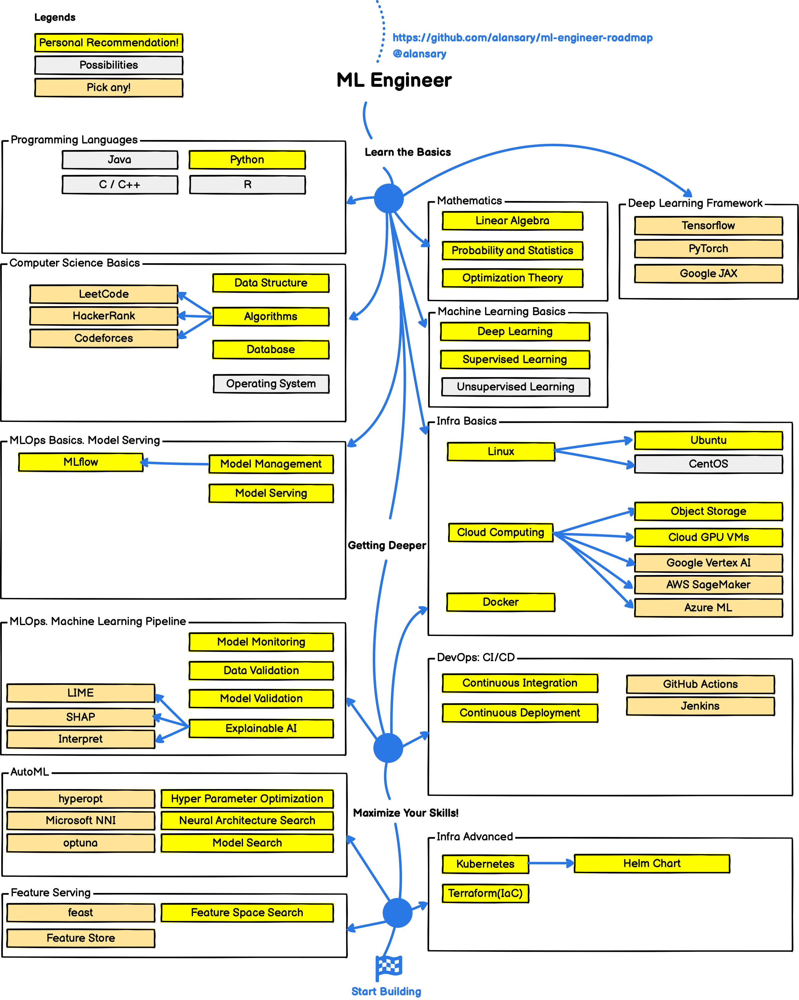
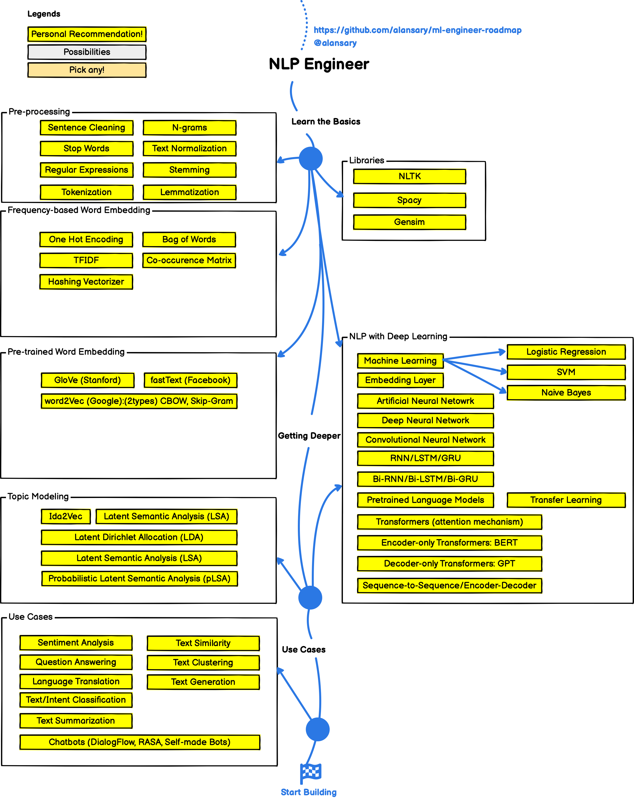

# Machine Learning Engineer Roadmap in 2023

> Roadmap to becoming a machine learning engineer in 2023.

Below you find a set of charts demonstrating the paths that you can take and the technologies that you would want to adopt in order to become a machine learning engineer.

> Check out my [Github](https://github.com/alansary).

***

<h3 align="center"><strong>Purpose of these Roadmaps</strong></h3>

> The purpose of these roadmaps is to give you an idea about the landscape and to guide you if you are confused about what to learn next and not to encourage you to pick what is hip and trendy. You should grow some understanding of why one tool would be better suited for some cases than the other and remember hip and trendy never means best suited for the job.

<h3 align="center"><strong>Note to Beginners</strong></h3>

> These roadmaps cover everything that is there to learn for the paths listed below. Don't feel overwhelmed, you don't need to learn it all in the beginning if you are just getting started.

***

If you think that these can be improved in any way, please do suggest.

## ML Engineer Roadmap

## NLP Engineer Roadmap

## 🚦 Wrap Up

If you think any of the roadmaps can be improved, please do open a PR with any updates and submit any issues. Also, I will continue to improve this, so you might want to watch/star this repository to revisit.

## 🙌 Contribution

The roadmaps are built using [Balsamiq](https://balsamiq.com/products/mockups/). Project file can be found at `/project-files` directory. To modify any of the roadmaps, open Balsamiq, create a new project, then copy and past the JSON file content in the wireframe, it will open the roadmap for you, update it, upload and update the images in readme and create a PR.

- Open pull request with improvements
- Discuss ideas in issues
- Spread the word
- Reach out to me directly at mohamed.alansary.c@gmail.com.